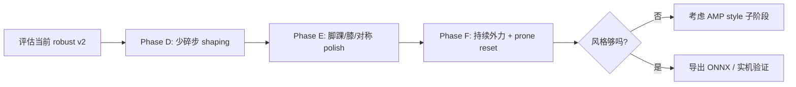

# G1 Recovery 工作流与下一步优化

本文档汇总当前 **G1 起身恢复（Recovery）** 任务的训练路线、已有实验、快捷脚本，以及针对「姿势更自然、少碎步、被压着也能起来」的后续计划。

更底层的迁移背景见：{doc}`g1_recovery_migration`。

## 1. 任务是什么

- **任务 ID**：`Mjlab-Recovery-Flat-Unitree-G1`
- **目标**：从倒地状态自主站起，并稳定保持站立。
- **推理时**：策略**不**读取参考动作，只使用本体感知观测（部署友好）。
- **训练时**：可选用转换后的 get-up 动作库做 **teacher reset**（仅初始化状态，不是跟踪任务）。

Teacher 动作目录（默认）：

```text
artifacts/recovery_motions/g1_amp_get_up/
```

## 2. 我们做了什么（按阶段）

### 阶段 A：能站起来（baseline）

- 修正 reset：motion-derived fallen pose + settle，避免随机空投穿地。
- 保守 PPO 超参，避免 `Policy/mean_std` 飙到 2.0 导致乱抖。
- 代表 run：`2026-04-11_19-29-55`（`mean_reward≈92.6`，`mean_std≈0.70`）。

### 阶段 B：站稳姿态打磨（late-phase polish）

在接近站立高度时，增加 **高度门控** 奖励，抑制脚踝抖动、改善末态姿势：

| 奖励项 | 作用 |
|--------|------|
| `late_phase_orientation` | 末段躯干更竖直 |
| `late_phase_base_motion` | 末段基座线/角速度更小 |
| `late_phase_ankle_vel_l2` | 惩罚脚踝关节速度 |
| `late_phase_ankle_home` | 脚踝回到默认站立角 |
| `late_phase_hip_home` | 髋 yaw/roll 回默认 |
| `late_phase_arm_home` | 手臂回默认 |
| `action_acc_l2` | 二阶动作平滑（减 chatter） |

代表 run：

- `2026-04-14_16-11-41_late_phase_fresh_restart`（新 reward 首次完整 6000 iter）
- `2026-04-15_11-07-35_late_phase_polish_full_v1`（4096 env 长跑；用于 robust 续训）

### 阶段 C：抗扰动 fine-tune

在 polish checkpoint（通常 `model_4400.pt`）上续训，并加强 push curriculum：

- push 间隔：`4–6 s`（更频繁）
- 在 iter `4500/5000/5500` 阶梯加大 `x/y/yaw` 扰动（峰值约 `±0.24 m/s`，yaw `±0.6`）

**当前推荐 checkpoint run**：

```text
logs/rsl_rl/g1_recovery/2026-04-15_16-03-46_late_phase_push_robust_v2_resume4400/
  model_5999.pt   # 默认用于 play / 部署评估
```

末次训练指标（W&B summary）：

| 指标 | 值 | 解读 |
|------|-----|------|
| `Train/mean_reward` | 159.2 | 高于 polish-only 阶段 |
| `Train/mean_episode_length` | 600 | 满 episode，能站稳 |
| `Policy/mean_std` | 0.49 | 方差受控，无明显乱抖 |
| `Episode_Reward/late_phase_ankle_home` | 0.36 | 脚踝末态仍有提升空间 |
| `Episode_Termination/joint_vel_limit` | 0 | 关节超速终止很少 |
| `Curriculum/push_velocity` | 已到最强档 | 扰动课程跑满 |

**仍存在的观感问题**（需下一阶段解决）：

- 脚掌仍有轻微外翻 / 站距偏宽
- 起身过程中偶有小碎步
- 被持续侧向推或「压着」时，尚未系统训练

## 3. 快捷脚本

所有脚本在 `scripts/recovery/`，详见 `scripts/recovery/README.md`。

```bash
# 一键查看有哪些 run
./scripts/recovery/list_runs.sh

# 本地交互 play（默认 robust v2 @ 5999）
./scripts/recovery/play_gui.sh

# 录视频 + 抽帧
./scripts/recovery/play_video.sh
./scripts/recovery/extract_frames.sh

# 训练
./scripts/recovery/train_smoke.sh          # 冒烟
./scripts/recovery/train_polish_full.sh    # 从零 polish
./scripts/recovery/train_robust_resume.sh  # 从 polish 续训 robust
```

### 手动等价命令

```bash
cd /path/to/mjlab

# Play
uv run play Mjlab-Recovery-Flat-Unitree-G1 \
  --checkpoint-file logs/rsl_rl/g1_recovery/2026-04-15_16-03-46_late_phase_push_robust_v2_resume4400/model_5999.pt \
  --num-envs 1 \
  --viewer native \
  --no-terminations True \
  --teacher-motion-path artifacts/recovery_motions/g1_amp_get_up

# 录视频（无显示器用 viser）
uv run play Mjlab-Recovery-Flat-Unitree-G1 \
  --checkpoint-file .../model_5999.pt \
  --num-envs 1 --viewer viser --video True --video-length 240 \
  --no-terminations True \
  --teacher-motion-path artifacts/recovery_motions/g1_amp_get_up
```

视频输出路径：`{run_dir}/videos/play/rl-video-step-0.mp4`

## 4. 代码地图（改奖励时看这里）

| 文件 | 内容 |
|------|------|
| `src/mjlab/tasks/recovery/recovery_env_cfg.py` | 奖励权重、事件、课程 |
| `src/mjlab/tasks/recovery/mdp/rewards.py` | `late_phase_*` 等奖励实现 |
| `src/mjlab/tasks/recovery/mdp/events.py` | `RecoveryReset`、向上辅助力 |
| `src/mjlab/tasks/recovery/mdp/curriculums.py` | push / teacher 概率课程 |
| `src/mjlab/tasks/recovery/config/g1/env_cfgs.py` | G1 传感器、play 模式 |
| `tests/test_recovery_rewards.py` | 单奖励单元测试 |
| `tests/test_recovery_task.py` | 课程与配置回归测试 |

## 5. 评估时看什么

### 训练曲线（W&B / TensorBoard）

- `Train/mean_episode_length` → 是否接近 600
- `Policy/mean_std` → 是否 < 1.0（最好 ~0.5）
- `Episode_Reward/stand_bonus`、`target_base_height`
- `Episode_Reward/late_phase_*` → 末态质量
- `Episode_Termination/root_height_floor`、`joint_vel_limit`

### 视频 / play 定性

- 起身是否一次成型，还是多次小碎步纠错
- 站定后脚踝 roll 是否外翻、双膝是否对称
- 被推后能否恢复，而不是立刻坐倒
- 手臂是否过度前摆、躯干是否侧倾

**不要只看最终 checkpoint**：中间 iter（如 4500、5000）往往更自然。

## 6. 下一步优化路线图

目标：**姿势安全拟人、少碎步、被压着也能起来**。

建议仍按「先质量、后难度」分三条线并行迭代，每次只改少量 knob，便于归因。

### 6.1 减少小碎步（locomotion-style during rise）

**现象**：接近站立时脚在地面快速调整，reward 仍高但动作不好看。

**可尝试**（按侵入性从低到高）：

1. **加强末段基座速度惩罚**  
   - 提高 `late_phase_base_motion` 权重，或收紧 `lin_vel_std` / `ang_vel_std`。
2. **脚接触 / 摆动惩罚**（需新增奖励）  
   - 参考 HoST / amp_rec：在 `root_height > 阈值` 时惩罚双脚同时离地、或单脚接触时间过长导致的 shuffle。
   - 对 G1 可用 foot contact sensor + `feet_air_time` 变体，仅在 recovery 末段门控开启。
3. **提高 `action_rate_l2` / `action_acc_l2`**  
   - 略增权重，抑制高频踏步；注意别过大导致站不起来。
4. **对称性奖励**  
   - 左右髋/踝/膝角度差的 L2 或 exp 核，仅在 late phase 生效。

**验收**：同一 fallen reset 下，起身阶段脚离地次数减少，站定时间更短。

### 6.2 姿势更拟人、更安全

**现象**：功能性能站住，但站距宽、脚掌外翻、手臂姿势不自然。

**可尝试**：

1. **收紧 `late_phase_ankle_home`**  
   - 减小 `std`（如 `0.2 → 0.15`）或略增权重；专门盯 `ankle_roll`。
2. **增加 `late_phase_knee_home`**  
   - 与 hip/ankle 同样用 `late_phase_posture`，避免直腿锁死或内扣。
3. **躯干 / 骨盆朝向**  
   - 加强 `target_orientation` 或新增 `late_phase_pelvis_yaw` 对齐世界系。
4. **自碰撞与关节限位**  
   - 已有 `self_collisions`、`joint_pos_limits`；可略增权重防「拧关节」起身。
5. **风格先验（中期）**  
   - 若 shaping 不够，再考虑 AMP / 判别器风格奖励（`amp_rec` 路线），用 get-up 片段做 style reward，**不要**一开始就上。

**验收**：站定后踝关节 roll 接近 0、双膝对称、手臂贴近身侧，无明显拧腰。

### 6.3 被压着 / 强扰动下也能起来

**现象**：当前 push 是瞬时速度扰动；真实「被压着」是持续外力或躯干被压住。

**可尝试**：

1. **持续推力事件**（新增 `mdp/events`）  
   - 在 torso 上施加随机方向持续力 `F`，持续 `0.5–2 s`，课程化 `F` 大小。
2. **Prone / 侧卧 reset 比例**  
   - 提高 motion fallen 窗口早期比例，或增加「面朝下」姿态采样。
3. **延迟减小 `upward_assist`**  
   - 在强扰动阶段保持更久辅助力，再衰减到 0，避免早期被压死。
4. **Robust fine-tune 流程**  
   - 固定：`polish 至 4400–5000` → `robust 1600 iter`；每次只改 push/持续力一档。
5. **参考 HoST**  
   - 查看其起身阶段是否用分阶段 reward / 约束关节速度；挑选可映射到 `height_gate` 的项。

**验收**：play 时手动加大 `--env.events...` 或通过脚本施加侧向力，策略仍能完成起身。

## 7. 推荐实验顺序（接下来 2–3 周）



| 步骤 | 动作 | 规模 |
|------|------|------|
| D1 | 只调 `late_phase_base_motion` + `action_acc_l2` | 512 env × 600 iter 短跑 |
| D2 | 加脚接触/shuffle 惩罚（新 reward） | 4096 × 2000 iter |
| E1 | 收紧 ankle/knee home + 对称项 | 从 `model_4400` resume × 1600 |
| F1 | 持续推力事件 + 课程 | 同上 resume |
| F2 | 全量 6000 iter，对比 4500/5000/5999 视频 | 4096 × 6000 |

每次实验记录：run 名、改动的 yaml 字段、3 个 checkpoint 的视频路径。

## 8. 与参考仓库的关系

| 仓库 | 可借鉴 | 暂不直接移植 |
|------|--------|----------------|
| `amp_rec` | AMP 风格奖励、判别器训练流程、get-up 数据 | 整套 `PPOAMP` runner |
| `HoST` | 分阶段 reward、二阶平滑、起身约束 | Isaac 环境实现 |

当前 mjlab recovery **仍是 PPO + shaping**，不是 AMP；风格问题优先用 **late-phase + 接触惩罚** 解决，不够再开 AMP 子项目。

## 9. 动作片段：如何裁剪、转换与可视化

`artifacts/recovery_motions/g1_amp_get_up/` 里的数据是 **两阶段** 得到的：

1. **时间裁剪**（在 `amp_rec`）：从长动作里切出 `[start, end)` 帧，保存为 `.pkl`
2. **格式转换**（在 `mjlab`）：`.pkl` → `.npz`，并重排关节顺序（**不再裁剪**）

### 9.1 文件名含义

示例：`fallAndGetUp1_subject1_1060_1150.npz`

| 部分 | 含义 |
|------|------|
| `fallAndGetUp1` | 原始动作序列名 |
| `subject1` | 受试者 / 片段 ID |
| `1060` | 裁剪起始帧（含） |
| `1150` | 裁剪结束帧（不含，Python 切片语义） |

帧数 = `1150 - 1060 = 90`，与 npz 里 `joint_pos.shape[0]` 一致。

当前目录约 24 条 clip，与 `amp_rec` 中
`source/legged_lab/legged_lab/data/MotionData/g1_29dof/amp/get_up/` 一一对应。

### 9.2 如何裁剪片段（amp_rec，需 Isaac Lab 环境）

mjlab **没有** 时间裁剪脚本；裁剪在 `amp_rec` 用 `single_retarget.py` 完成。

核心逻辑在 `amp_rec/scripts/tools/retarget/gmr_to_lab.py` 的 `extract_gmr_data()`：

```python
root_pos[start_frame:end_frame]
dof_pos[start_frame:end_frame]
```

**单条片段导出示例**（需先有一份较长的 GMR `.pkl` 源文件）：

```bash
cd /path/to/amp_rec

python scripts/tools/retarget/single_retarget.py \
  --robot g1 \
  --input_file /path/to/long_motion/fallAndGetUp1_subject1.pkl \
  --output_file source/legged_lab/legged_lab/data/MotionData/g1_29dof/amp/get_up/fallAndGetUp1_subject1_1060_1150.pkl \
  --config_file scripts/tools/retarget/config/g1_29dof.yaml \
  --frame_range 1060 1150 \
  --loop clamp \
  --headless
```

说明：

- `--frame_range START END`：`[START, END)`，与文件名中的两个数字一致
- 输出 `.pkl` 已是 **lab 关节顺序** + 带 `key_body_pos` 的 legged_lab 格式
- `dataset_retarget.py` 只做**整段**批量转换，**不支持** `--frame_range`

片段列表与 AMP 采样权重见
`amp_rec/.../g1_amp_get_up_env_cfg.py` 的 `motion_data_weights`（约 24 条）。

### 9.3 如何转换到 mjlab（pkl → npz）

在 mjlab 仓库根目录：

```bash
cd /path/to/mjlab

uv run python -m mjlab.scripts.amp_pkl_to_npz \
  --input /path/to/amp_rec/source/legged_lab/legged_lab/data/MotionData/g1_29dof/amp/get_up \
  --output artifacts/recovery_motions/g1_amp_get_up
```

脚本：`src/mjlab/scripts/amp_pkl_to_npz.py`

- 读取每个 `.pkl` 的**全部帧**（文件本身已是裁剪后的短 clip）
- 将 `dof_pos` 从 amp_rec `lab_dof_names` 重排到 mjlab G1 顺序
- 若缺少速度字段，用差分补 `root_lin_vel` / `joint_vel`
- 输出字段：`fps`, `root_pos`, `root_quat`, `root_lin_vel`, `root_ang_vel`, `joint_pos`, `joint_vel`, `joint_names`

### 9.4 如何可视化裁剪后的片段

#### A. 播放整条 teacher 动作（推荐第一步）

脚本：`src/mjlab/scripts/play_recovery_motion.py`

**GUI 播放指定 clip**：

```bash
cd /path/to/mjlab

uv run python -m mjlab.scripts.play_recovery_motion \
  --motion-path artifacts/recovery_motions/g1_amp_get_up \
  --clip fallAndGetUp2_subject2_1200_1370
```

**无头冒烟**（不弹窗，跑 120 帧）：

```bash
uv run python -m mjlab.scripts.play_recovery_motion \
  --motion-path artifacts/recovery_motions/g1_amp_get_up \
  --clip fallAndGetUp2_subject2_1200_1370 \
  --headless \
  --max-frames 120
```

**常用参数**：

| 参数 | 作用 |
|------|------|
| `--motion-path` | 目录或单个 `.npz` |
| `--clip` | 片段名（可带或不带 `.npz` 后缀） |
| `--headless` | 不打开 MuJoCo viewer |
| `--max-frames N` | 最多播放 N 帧后退出 |
| `--no-loop` | 播完一遍就停 |
| `--fps` | 覆盖播放帧率 |

#### B. 预览 fallen reset 姿态（训练用 reset 分布）

脚本：`src/mjlab/scripts.preview_recovery_fallen_poses`

用于检查 **训练 reset** 采样的倒地姿态是否合理（不是播完整起身轨迹）：

```bash
uv run python -m mjlab.scripts.preview_recovery_fallen_poses \
  --motion-path artifacts/recovery_motions/g1_amp_get_up \
  --progress-max 0.08 \
  --settle-steps 10 \
  --num-samples 3
```

`--progress-max 0.08` 对应训练里 `motion_fallen_progress_range` 的前 8% 片段。

更完整的 play / reset 示例见 {doc}`g1_recovery_migration` 的 “How To Play Converted Motions” 一节。

#### C. 训练时片段内部的“逻辑裁剪”

即使 npz 只有 ~90 帧，recovery 训练还会在 clip **内部** 按 progress 再采样：

| 用途 | 配置项 | 默认范围 |
|------|--------|----------|
| teacher reset | `teacher.min_progress` / `max_progress` | 8% – 60% |
| fallen reset | `motion_fallen_progress_range` | 0% – 8% |

这不是文件级裁剪，而是 `RecoveryMotionLoader` 在已有短 clip 上取子区间。

### 9.5 端到端流程小结

```text
长 GMR .pkl
    │  amp_rec: single_retarget.py --frame_range START END
    ▼
短片段 .pkl  (文件名含 START_END)
    │  mjlab: amp_pkl_to_npz.py
    ▼
.npz in artifacts/recovery_motions/g1_amp_get_up/
    │  mjlab: play_recovery_motion.py  (检查动作是否合理)
    ▼
训练: --env.teacher.motion-path .../g1_amp_get_up
```

## 10. 相关链接

- 脚本：`scripts/recovery/README.md`
- 迁移笔记：{doc}`g1_recovery_migration`（含更多 `play_recovery_motion` / `preview_recovery_fallen_poses` 示例）
- 转换动作：`uv run python -m mjlab.scripts.amp_pkl_to_npz --help`
- 预览 teacher 动作：`uv run python -m mjlab.scripts.play_recovery_motion --help`
